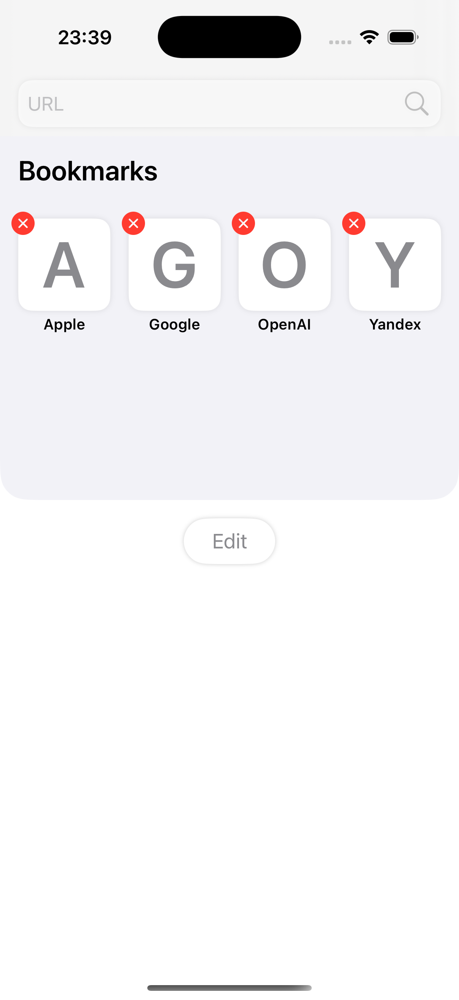
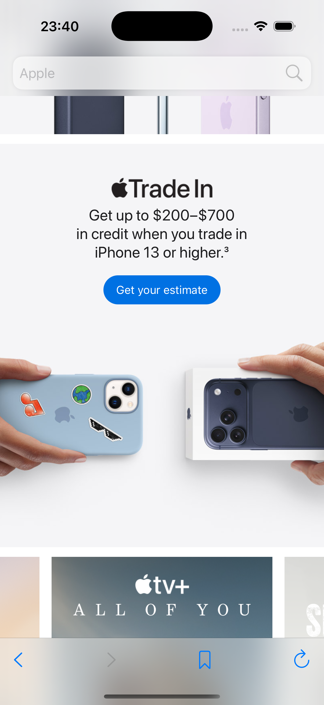
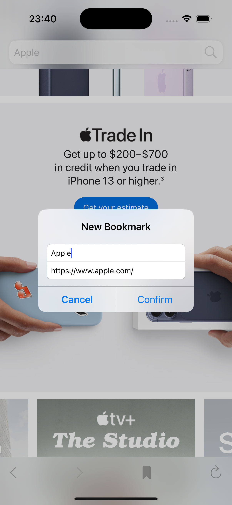
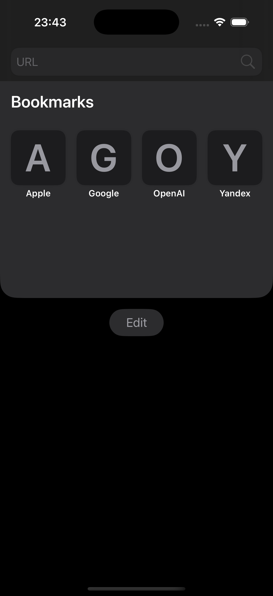
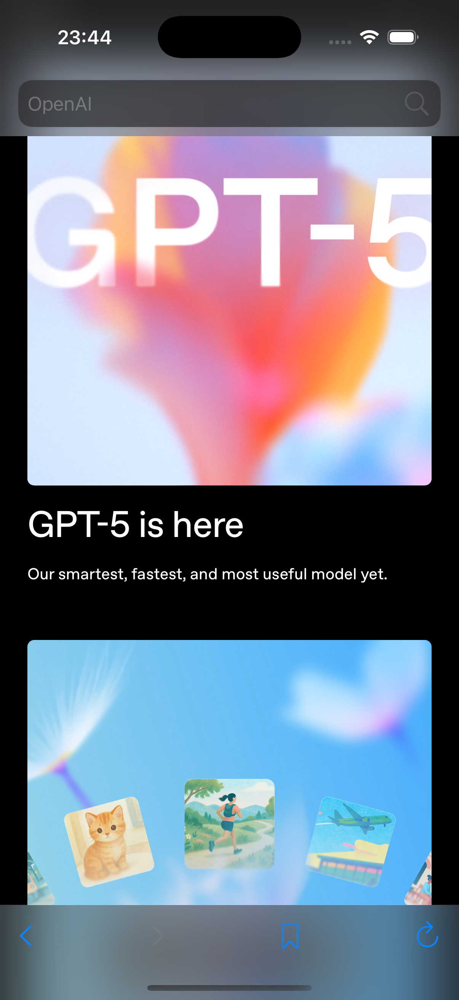
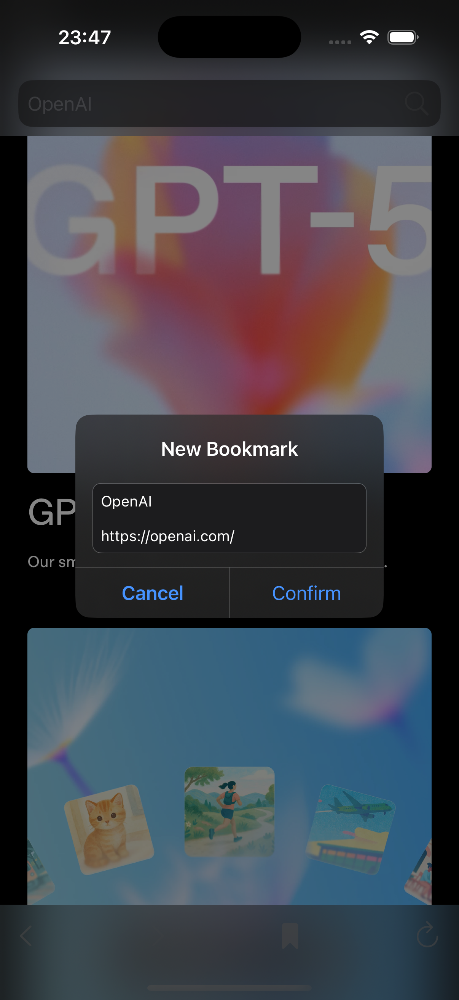
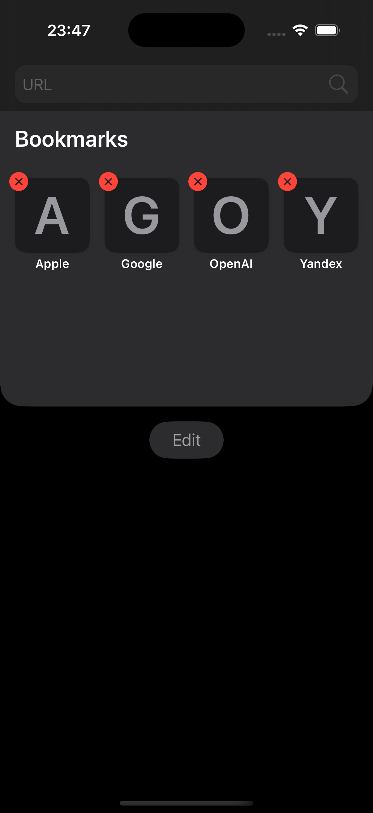

# Браузер на WebKit

## Описание проекта
Учебный iOS-проект, показывающий работу с фреймворком WebKit и управление закладками в простом браузере.

## Задача
Создать браузер с полем ввода адреса, кнопками "Перейти" и "Добавить закладку", а также таблицей закладок.

## Решение
Экран содержит WKWebView, настраиваемую панель ввода URL и таблицу закладок. При нажатии на элементы списка выполняется переход на сохранённую страницу, а новые закладки добавляются из текущего адреса.

## Скриншот
### Светлая Тема
<table>
  <tr>
    <td style="border: none;"></td>
    <td style="border: none;"></td>
    <td style="border: none;"></td>
    <td style="border: none;"></td>
  </tr>
</table>

### Тёмная тема
<table>
  <tr>
    <td style="border: none;"></td>
    <td style="border: none;"></td>
    <td style="border: none;"></td>
    <td style="border: none;"></td>
  </tr>
</table>
